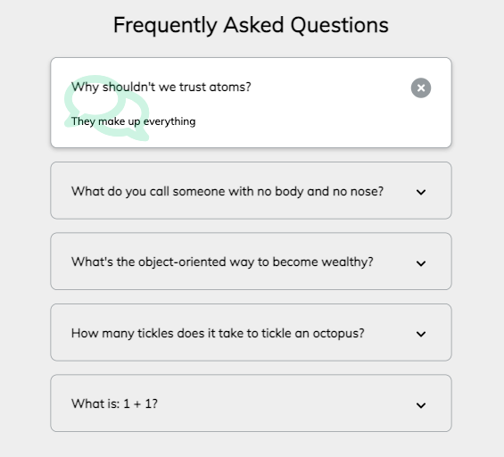

# FAQ Collapse

The project is a web application that uses HTML, CSS, and JavaScript to create a FAQ page. The page displays a list of frequently asked questions, and users can click on any question to toggle the answer's visibility.

## How to Use

1. Clone or download the repository to your local machine.

2. Open the `index.html` file in your preferred web browser.
3. Click on any FAQ question to toggle the answer's visibility. You can toggle all questions to view all answers simultaneously.

## Dependencies

The project does not have any external dependencies. All HTML, CSS, and JavaScript code is included in the project's files.

## File Structure

- `index.html`: contains the HTML structure of the page.
- `style.css`: contains the CSS styles applied to the page.
- `script.js`: contains the JavaScript code that enables the FAQ questions to toggle the answers' visibility.
